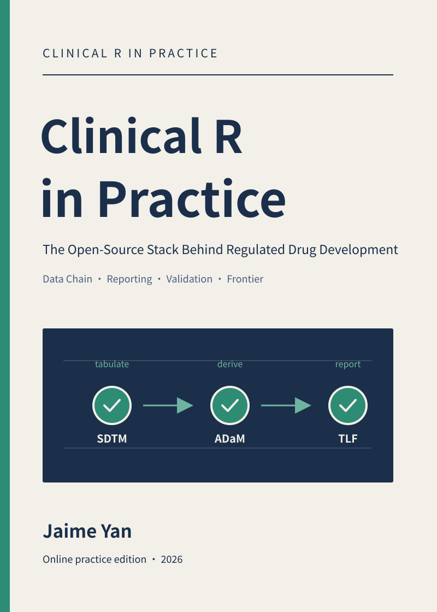
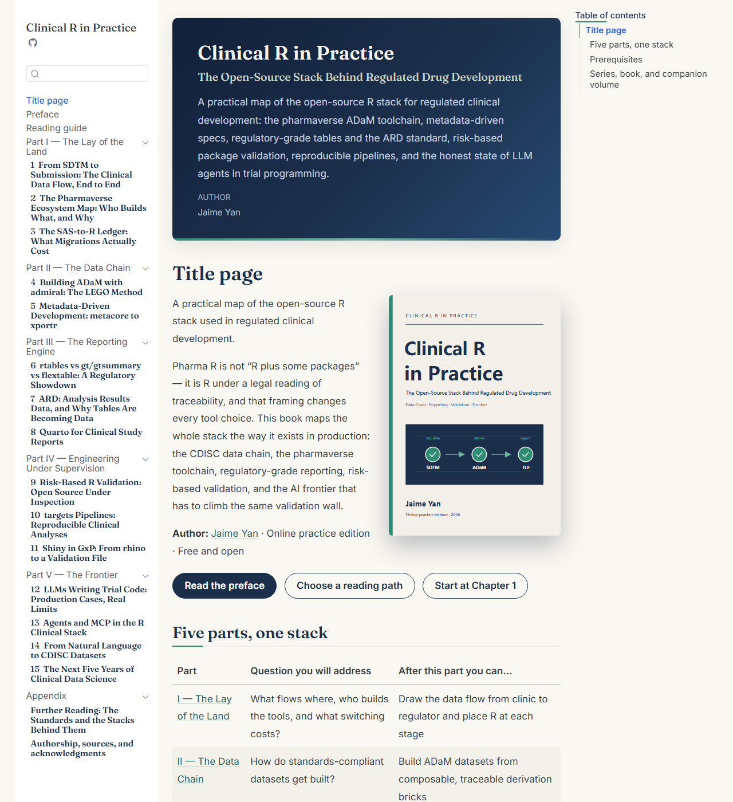
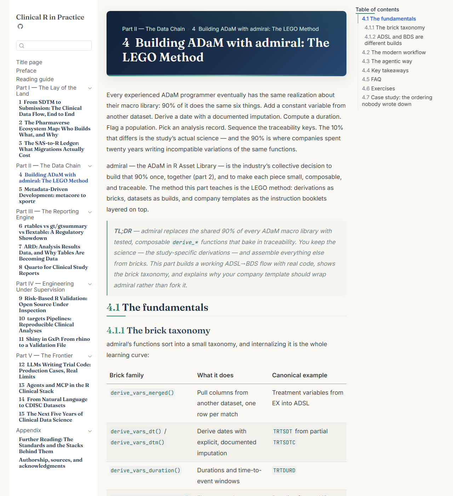

# Clinical R in Practice



A free, open Quarto book mapping the open-source R stack used in regulated
clinical development — built from the *Clinical R in Practice* series on
[jaimeyan.com](https://jaimeyan.com), expanded with exercises and case studies.

[](https://doi.org/10.5281/zenodo.23085878)
[](https://creativecommons.org/licenses/by-sa/4.0/) [](https://github.com/yanmingyu92/clinical-r-in-practice/actions/workflows/quarto-gh-pages.yml) [](https://quarto.org/)

## Read the book

| Edition | Link |
|---|---|
| Online edition (free) | <https://yanmingyu92.github.io/clinical-r-in-practice/> |
| Author's site | <https://jaimeyan.com> |
| Companion volume: *Modern R in Practice* | <https://yanmingyu92.github.io/posit-conf-2026-bilingual/book/en/> |

## About the book

Fifteen chapters in five parts, written as a single map of the stack the way it
exists in production — no admiral chapter without the traceability rules above
it, no AI chapter without the validation wall it has to climb. Every chapter
ships runnable code, three exercises, a case study, and a selection checklist
designed to be stolen for your next validation meeting.

- **Part I · The Lay of the Land (3 ch)** — the clinical data flow end to end, the pharmaverse ecosystem map, and the SAS→R migration ledger.
- **Part II · The Data Chain (2 ch)** — ADaM with admiral (the LEGO method) and metadata-driven development with metacore/xportr.
- **Part III · The Reporting Engine (3 ch)** — rtables vs gt/gtsummary vs flextable, the ARD standard, and Quarto for clinical study reports.
- **Part IV · Engineering Under Supervision (3 ch)** — risk-based R validation, targets pipelines, and Shiny in GxP.
- **Part V · The Frontier (4 ch)** — LLMs writing trial code, agents and MCP, natural language to CDISC, and the next five years.

The parts teach three layers together: **L1** the rules (CDISC traceability,
risk-based validation — decade half-life), **L2** the stack (pharmaverse
toolchain — years), and **L3** the frontier (LLM agents — months; every
frontier chapter carries a last-verified date).

## Screenshots

| Book home | A data-chain chapter |
|---|---|
|  |  |
| Five-part navigation, cover, and reading paths. | Exercises, case study, and selection checklists in every chapter. |

## Cite this book

> Yan, J. (2026). *Clinical R in Practice: The Open-Source Stack Behind
> Regulated Drug Development*. Zenodo. <https://doi.org/10.5281/zenodo.23085878>

```bibtex
@book{yan2026clinicalr,
  author    = {Yan, Jaime},
  title     = {Clinical R in Practice: The Open-Source Stack Behind Regulated Drug Development},
  year      = {2026},
  publisher = {Zenodo},
  doi       = {10.5281/zenodo.23085878},
  url       = {https://doi.org/10.5281/zenodo.23085878}
}
```

## Author

**Jaime Yan** — personal site [jaimeyan.com](https://jaimeyan.com) — GitHub
[@yanmingyu92](https://github.com/yanmingyu92).

## Repository tour

- `chapters/` — the 15 chapters (series text + `## Exercises` + `## Case study`)
- `index.qmd`, `preface.qmd`, `reading-guide.qmd`, `part-1..5.qmd`, `further-reading.qmd`, `acknowledgments.qmd` — front/back matter and part landing pages
- `assets/` — book theme (`book.css`), cover (`cover.svg`/`cover.png`), favicon
- `tools/sync-from-series.mjs` — incremental sync from the source series
- `.github/workflows/quarto-gh-pages.yml` — render & deploy on push to `main`

### Content source and sync

Chapter bodies originate from the *Clinical R in Practice* series on the
author's site and are regenerated by the site repo's `series-to-book.mjs`.
**Content corrections land in the series first**, then sync into the book:

```bash
node <site>/scripts/series-to-book.mjs --series clinical-r-in-practice --out /tmp/clinical-r-book-fresh
node tools/sync-from-series.mjs --fresh /tmp/clinical-r-book-fresh
```

The sync only rewrites `chapters/` and `preface.qmd`; `index.qmd` and
`_quarto.yml` are book-owned (layout and site metadata) and are never
overwritten.

### Build locally

```bash
quarto render          # renders the book into _book/
python scripts/qa_book.py   # structural QA checks
```

Generated HTML stays outside version control; pushing to `main` triggers the
GitHub Actions rebuild and deploy.

## License & attribution

The book text is original work by Jaime Yan, published under
[CC-BY-SA 4.0](https://creativecommons.org/licenses/by-sa/4.0/). Chapters link
to official package documentation and standards rather than reproducing them;
those retain their own licenses. Simulated data is used throughout — no patient
data. This repository is not affiliated with CDISC, the R Consortium, R
Validation Hub, or any company whose open-source packages it teaches.

---

如果这个项目对你有帮助，欢迎 Star ⭐ / Watch 关注更新。 · If this project helps you, a star is appreciated.
